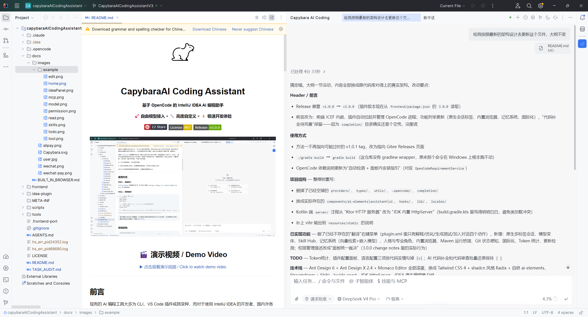
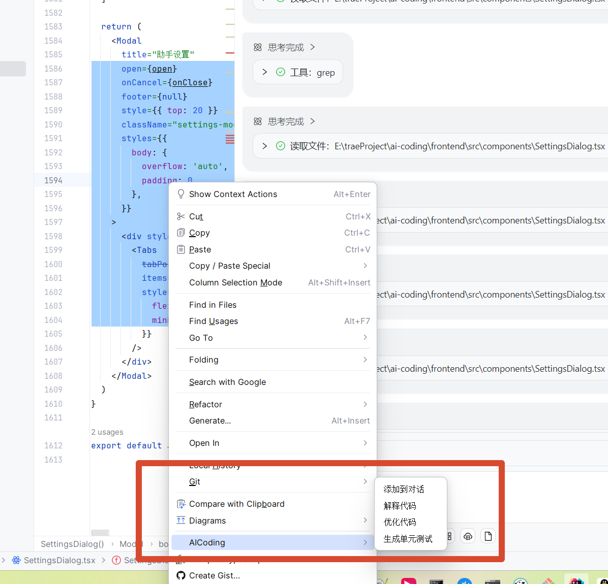
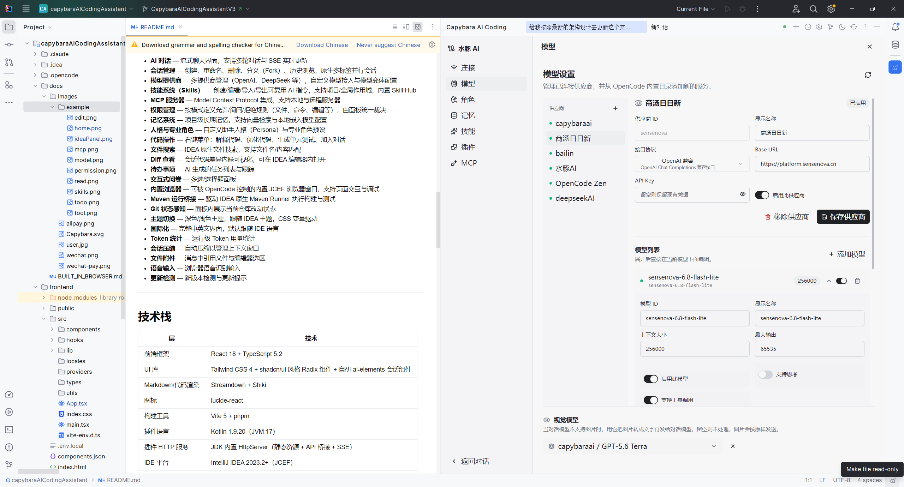
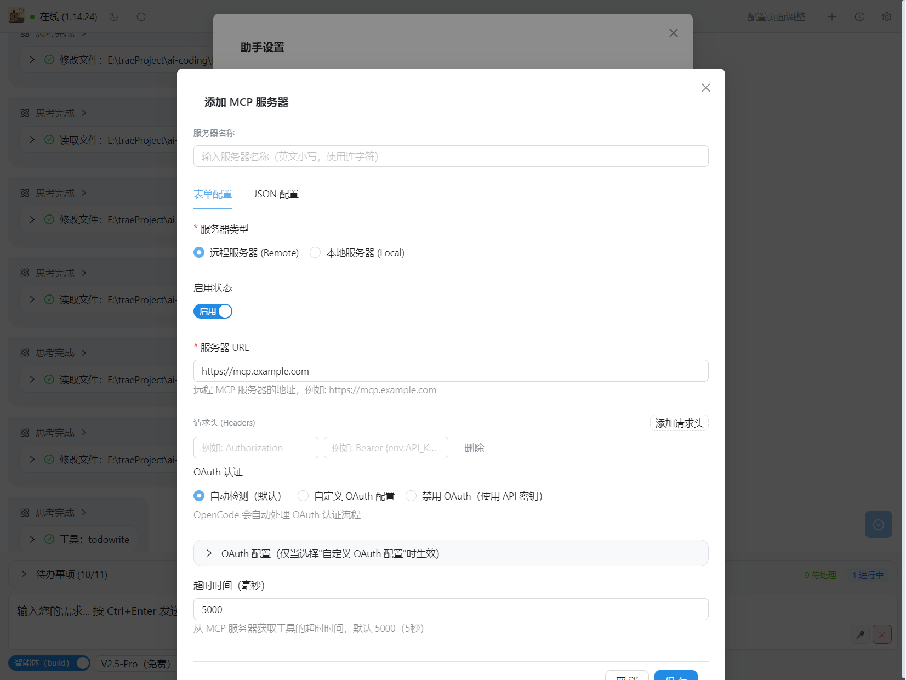
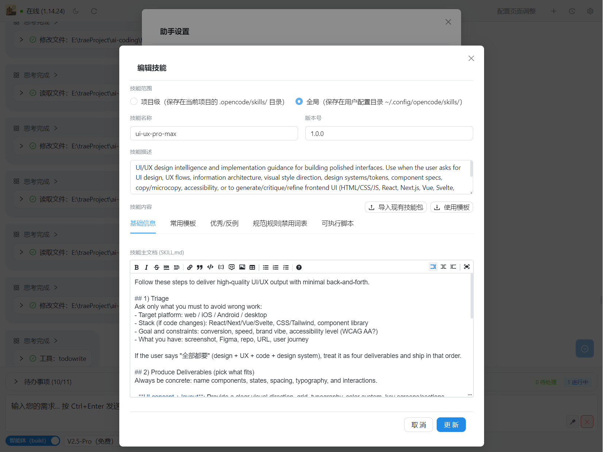
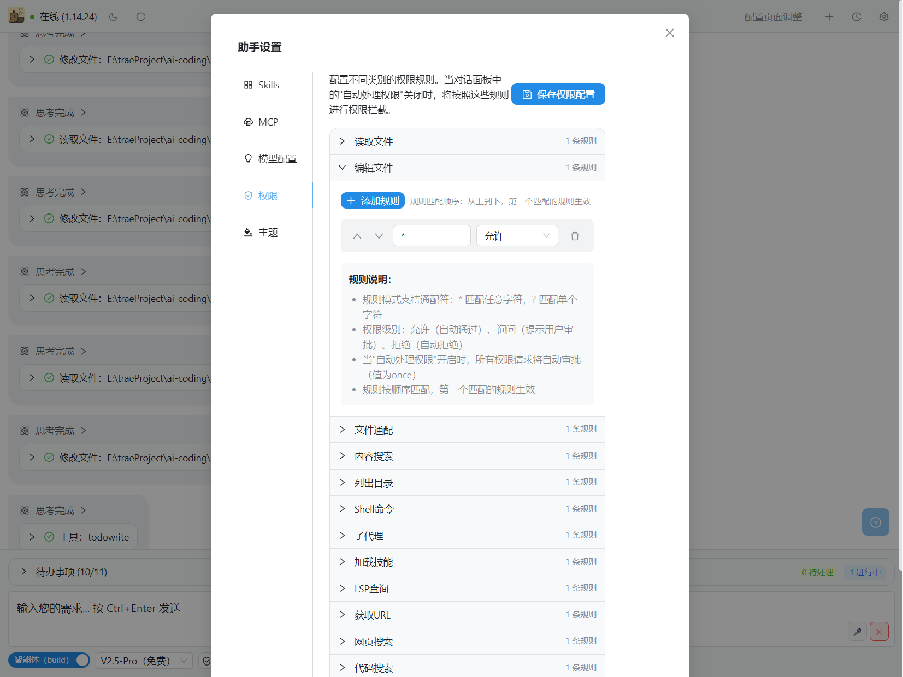
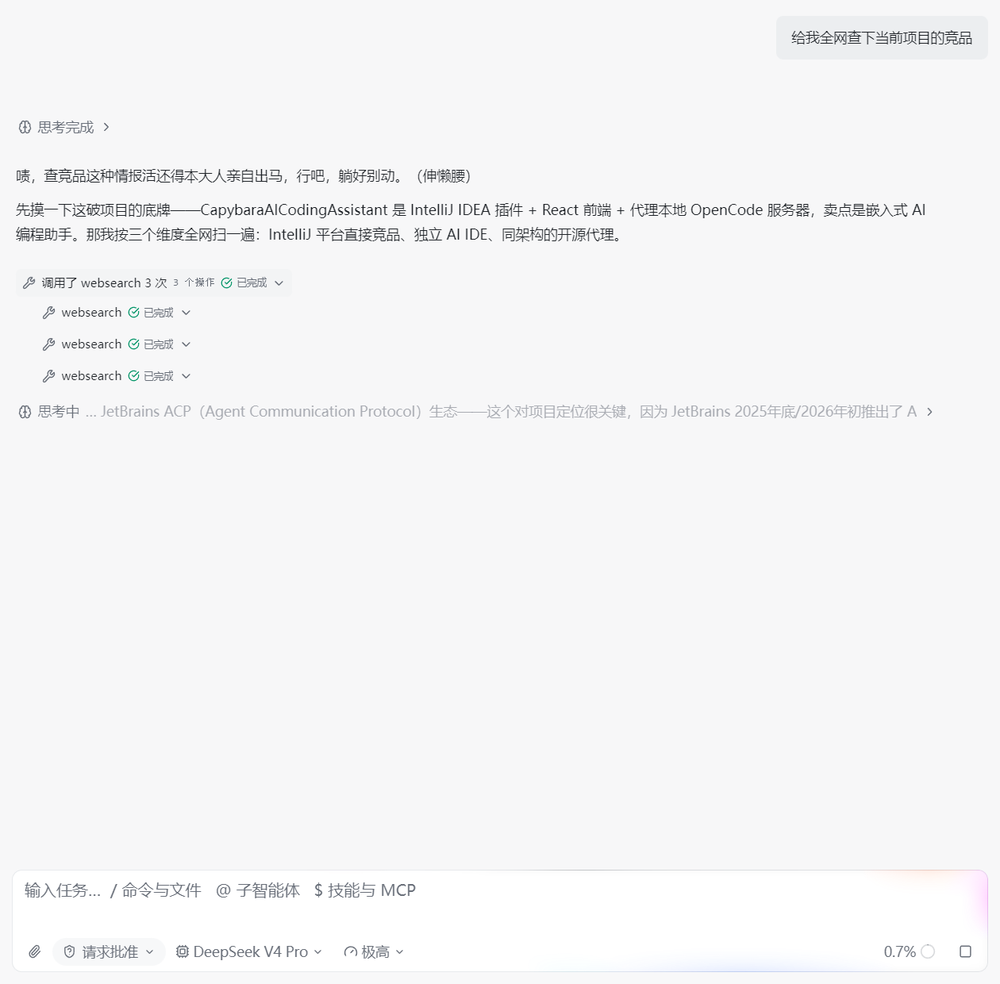
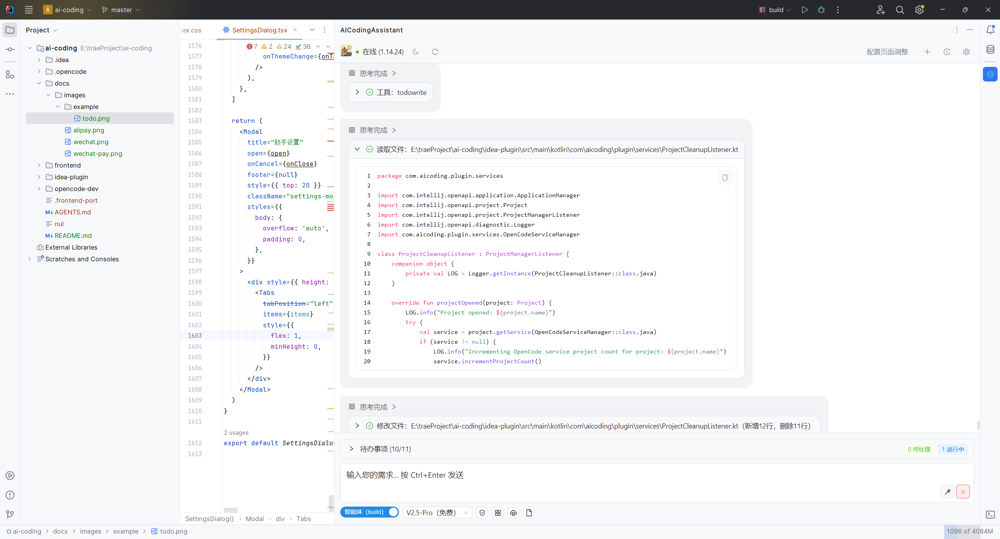
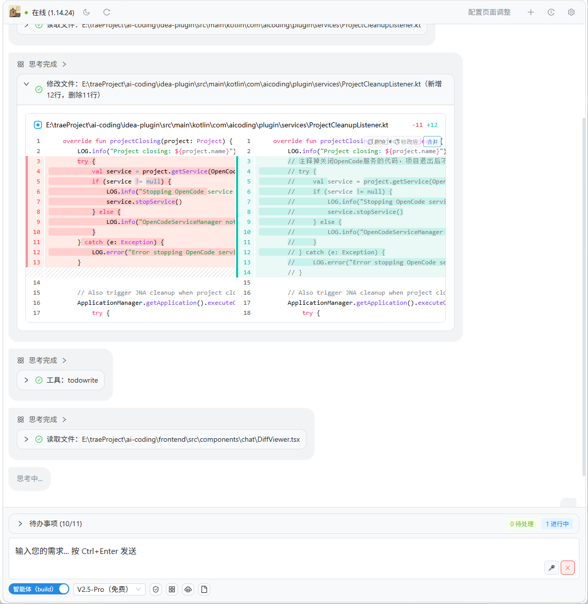
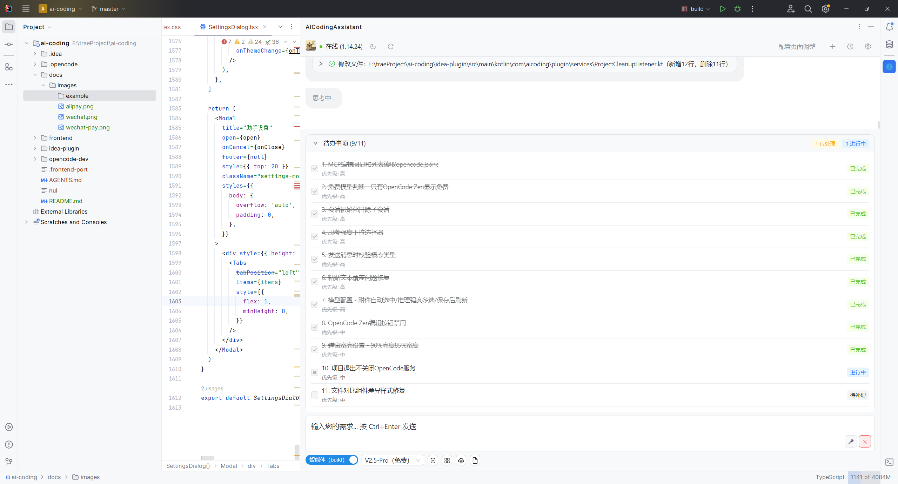

<div align="center">


# CapybaraAI Coding Assistant

**基于 OpenCode 的 IntelliJ IDEA AI 编程助手**

🚀 **自由模型接入** × 🔧 **高度自定义** × ⚡ **极速开发体验**

[](https://gitee.com/qianguanshui/capybaraAICodingAssistant)
[](LICENSE)
[](https://gitee.com/qianguanshui/capybaraAICodingAssistant/releases)

</div>

<div align="center">



</div>

---

## 前言

现有的 AI 编程工具大多为 CLI、VS Code 插件或其变种，而对于使用 IntelliJ IDEA 的开发者，国内外各大厂商的idea编程代理均不够灵活——无法自由添加自定义模型，功能上开发者自定义程度不高，限制极大。

故基于 [OpenCode](https://opencode.ai) 开源编程代理工具，编写了这款 IntelliJ IDEA 插件。前端直接嵌入 IDEA 中，依赖 OpenCode 服务运行，并提供了快速添加文件、代码补全（待完善）、右键菜单操作等功能。

Q：为什么重写前端，不引用官方前端

A：官方web前端bug太多，会话管理和回显混乱，样式也不适合嵌入进来

IntelliJ IDEA插件系统兼容性限制很多，如遇到问题请提Issues

---

## 使用方式

### 方法一：直接导入

从 `https://gitee.com/qianguanshui/capybaraAICodingAssistant/releases/tag/v1.0.0` 目录获取 ZIP 包，在 IDEA 中通过 `Settings → Plugins → ⚙ → Install Plugin from Disk` 导入即可使用。

### 方法二：源码编译

```bash
# 1. 构建前端（需要 pnpm）
cd frontend
pnpm install
pnpm build

# 2. 构建插件
cd ../idea-plugin
./gradle build

# 3. 产物在 idea-plugin/build/distributions/ 目录下,获取 ZIP 包，在 IDEA 中通过 `Settings → Plugins → ⚙ → Install Plugin from Disk` 导入即可使用。
```


> 插件依赖 OpenCode 服务，请确保本地已安装并配置好 [OpenCode](https://opencode.ai)。

---

## 项目结构

```
ai-coding/
├── frontend/                 # React + TypeScript + Vite 前端
│   ├── src/
│   │   ├── components/       # UI 组件（聊天、设置、权限面板等）
│   │   ├── providers/        # Ant Design X SDK 聊天提供商
│   │   ├── hooks/            # 自定义 Hooks（SSE 处理、滚动、压缩）
│   │   ├── types/            # TypeScript 类型定义
│   │   └── utils/            # API 客户端、工具函数
│   └── package.json
├── idea-plugin/              # IntelliJ IDEA 插件（Kotlin）
│   └── src/main/kotlin/com/aicoding/plugin/
│       ├── server/           # Ktor HTTP 服务器（API 代理）
│       ├── services/         # OpenCode 进程管理、设置持久化
│       ├── actions/          # 右键菜单操作（解释/优化/测试/添加对话）
│       ├── ui/               # JCEF 浏览器面板、编辑器集成
│       └── completion/       # AI 代码补全
├── .opencode/                # OpenCode CLI 配置
└── AGENTS.md                 # 开发指南
```

## 已实现功能

- **AI 对话** — 流式聊天界面，支持多轮对话与 SSE 实时更新
- **会话管理** — 创建、重命名、删除、分叉（Fork）、历史浏览
- **模型提供商** — 多提供商管理（OpenAI、DeepSeek 等），自定义模型接入
- **技能系统（Skills）** — 创建/编辑/导入/导出可复用 AI 指令，支持项目/全局作用域
- **MCP 服务器** — Model Context Protocol 集成，支持本地与远程服务器
- **权限管理** — 按模式定义允许/询问/拒绝规则（文件、命令、编辑等）
- **代码操作** — 右键菜单：解释代码、优化代码、生成单元测试、翻译、添加到对话
- **文件搜索** — 按文件名/内容搜索，支持模糊/精确匹配与扩展名过滤
- **Diff 查看** — 代码差异内联可视化
- **待办事项** — AI 生成的任务列表与跟踪
- **交互式问卷** — 多选/选择题面板
- **主题切换** — 深色/浅色主题，CSS 变量驱动
- **会话压缩** — 自动压缩以管理上下文窗口
- **文件附件** — 消息中引用文件

---

## TODO（待适配内容）

- [x] 权限自动确认(待完整功能测试)
- [x] MCP 配置管理(待完整功能测试)
- [x] Skill 配置管理(待完整功能测试)
- [x] 权限规则配置(待完整功能测试)
- [x] 语音输入-浏览器语音识别(待完整功能测试)
- [ ] Token统计
- [ ] 插件配置面板
- [ ] 语言配置（国际化）
- [ ] AI 代码补全
- [ ] 代码审查批量还原
- [ ] 其它好的点子...

---

## 技术栈

| 层 | 技术                              |
|---|---------------------------------|
| 前端框架 | React 18 + TypeScript 5.2       |
| UI 库 | Ant Design 6 + Ant Design X 2.4 |
| 构建工具 | Vite 5 + pnpm                   |
| 插件语言 | Kotlin 1.9.20                   |
| IDE 平台 | IntelliJ IDEA 2023.2+           |
| AI 后端 | OpenCode（开源）                    |
| 编辑器 | diffs & Monaco Editor           |

---

## 软件截图

| | |
|:---:|:---:|
| **IDE 集成面板** | **模型配置** |
|  |  |
| **MCP 配置** | **Skill 配置** |
|  |  |
| **权限配置** | **对话-工具调用** |
|  |  |
| **对话-读取文件** | **对话-编辑代码** |
|  |  |
| **待办事项** | |
|  | |

---


## 赞助

感谢以下小伙伴的咖啡支持 ☕

| 赞助人  | 金额      | 时间         | 留言         |
|------|---------|------------|------------|
| 风随心动 | 100 RMB | 2026-04-30 | 优化下界面（已安排） |
| —    | —       | —          | 虚位以待       |

> 如果你想出现在这里，请赞助后在备注中留下你的ID和留言。

---

## 写在最后


### 开源不易，烧了几十亿 token，白天上班跟生活对线，晚上和周六周末通宵为ai发电。如果觉得好用，可以请作者喝杯咖啡 ☕


|                 微信收款码                  | 支付宝收款码 |
|:--------------------------------------:|:---:|
|  |  |


### **作者微信：** 使用人多的话可以考虑建群互相交流技术


